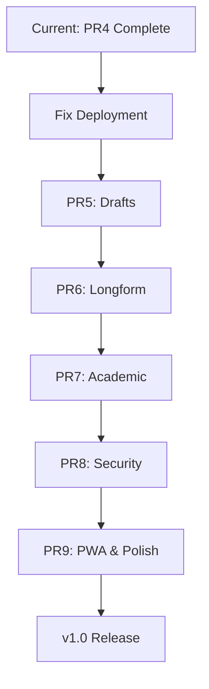

# Uddesa Project Analysis Report

**Generated:** 2025-10-08  
**Status:** Post-PR4, Pre-PR5

---

## Executive Summary

The Uddesa project is a local-first writing environment that successfully implements **PR1-PR4** features, with approximately **50% implementation progress** toward the full PR9 roadmap. The immediate blocker is **deployment configuration** - the Netlify site fails to load due to missing configuration files.

---

## 🔴 Critical Issues (Blocking Production)

### 1. **Netlify Deployment Failure**
**Severity:** Critical  
**Impact:** Site does not load at https://uddesa.netlify.app/

**Root Causes:**
- Missing [`netlify.toml`](netlify.toml) configuration file
- Missing [`public/_redirects`](public/_redirects) file for SPA routing
- Vite build may not be configured correctly for production

**Console Errors:**
```
Failed to load module script: Expected a JavaScript-or-Wasm module script 
but the server responded with a MIME type of "application/octet-stream"
```

**Required Fixes:**
1. Create `netlify.toml` with proper build configuration
2. Create `public/_redirects` to handle React Router routes
3. Verify Vite build output structure

---

## 📊 Implementation Status by PR

### ✅ PR1: Foundation (100% Complete)
- [x] Vite + React + TypeScript scaffold
- [x] Dexie IndexedDB integration (with memory fallback)
- [x] [`ShelfHome.tsx`](src/features/diaries/ShelfHome.tsx) - Diary shelf/home screen
- [x] [`DiaryRouter.tsx`](src/features/diaries/DiaryRouter.tsx) - Dynamic diary routing
- [x] [`Settings.tsx`](src/ui/Settings.tsx) - Settings skeleton
- [x] [`AppShell.tsx`](src/app/AppShell.tsx) - Application shell with navigation

### ✅ PR2: Canvas Support (100% Complete)
- [x] [`Canvas.tsx`](src/editors/excalidraw/Canvas.tsx) - Excalidraw wrapper
- [x] [`excalApi.ts`](src/editors/excalidraw/excalApi.ts) - Scene save/load API
- [x] [`ScratchpadView.tsx`](src/features/diaries/scratchpad/ScratchpadView.tsx) - Full scratchpad implementation
- [x] [`PageRail.tsx`](src/ui/PageRail.tsx) - Page navigation with thumbnails
- [x] [`thumbs.ts`](src/editors/excalidraw/thumbs.ts) - Thumbnail generation

### ✅ PR3: Blackboard (100% Complete)
- [x] [`BlackboardView.tsx`](src/features/diaries/blackboard/BlackboardView.tsx) - Blackboard canvas view
- [x] [`OutlinePanel.tsx`](src/ui/OutlinePanel.tsx) - Outline panel component
- [x] [`useOutline.ts`](src/features/diaries/blackboard/useOutline.ts) - Heading detection heuristics

### ✅ PR4: Text Editor Foundation (95% Complete)
- [x] [`RichText.tsx`](src/editors/tiptap/RichText.tsx) - Tiptap editor wrapper
- [x] [`schema.ts`](src/editors/tiptap/schema.ts) - Tiptap schema configuration
- [x] [`JournalView.tsx`](src/features/diaries/journal/JournalView.tsx) - Journal preset
- [x] [`paste.ts`](src/editors/tiptap/paste.ts) - Paste normalization
- [x] [`serialize.ts`](src/editors/tiptap/serialize.ts) - HTML/MD export
- [~] [`DateNode.ts`](src/editors/tiptap/extensions/DateNode.ts) - Basic date node (needs enhancement)

**Minor Gaps:**
- Word count display not visible in UI
- Export buttons need testing

### ❌ PR5: Drafts Preset (0% Complete)
**Status:** Placeholder only

**Missing:**
- [ ] [`DraftsView.tsx`](src/features/diaries/drafts/DraftsView.tsx) - Currently just placeholder
- [ ] [`TitleNode.ts`](src/editors/tiptap/extensions/TitleNode.ts) - Empty stub class
- [ ] Word count component/hook
- [ ] Drafts-specific schema configuration
- [ ] Title + body document structure

**Placeholder Code:**
```tsx
// src/features/diaries/drafts/DraftsView.tsx
export function DraftsView({ diary }: DiaryScreenProps) {
  return (
    <section className="diary-placeholder">
      <h2>{diary.title}</h2>
      <p>Drafts editor with title and body lands in PR5.</p>
    </section>
  );
}
```

### ❌ PR6: Longform Preset (0% Complete)
**Status:** Placeholder only

**Missing:**
- [ ] [`LongformView.tsx`](src/features/diaries/longform/LongformView.tsx) - Currently just placeholder
- [ ] Outline generation from headings
- [ ] [`Footnote.ts`](src/editors/tiptap/extensions/Footnote.ts) - Empty stub class
- [ ] Footnote management UI
- [ ] Chapter/section navigation

### ❌ PR7: Academic Preset (0% Complete)
**Status:** Placeholder only

**Missing:**
- [ ] [`AcademicView.tsx`](src/features/diaries/academic/AcademicView.tsx) - Currently just placeholder
- [ ] [`MathNode.ts`](src/editors/tiptap/extensions/MathNode.ts) - Empty stub class
- [ ] Math rendering (KaTeX/MathJax integration)
- [ ] Citations manager
- [ ] Bibliography generation

### ❌ PR8: Data & Security (0% Complete)
**Status:** Stub implementations only

**Missing:**
- [ ] [`backup.ts`](src/services/backup.ts) - Export/Import stubs only
- [ ] [`crypto.ts`](src/services/crypto.ts) - Encrypt/Decrypt stubs only
- [ ] Lock/Unlock UI
- [ ] Password management
- [ ] Keyboard shortcuts system
- [ ] Shortcuts reference modal

**Current Stubs:**
```typescript
// src/services/backup.ts
export function exportAll() {
  return Promise.resolve(new Blob());
}

// src/services/crypto.ts
export function encrypt() {
  return Promise.resolve(new Uint8Array());
}
```

### ❌ PR9: Production Polish (0% Complete)
**Status:** Not started

**Missing:**
- [ ] PWA manifest.json
- [ ] Service worker for offline support
- [ ] Texture/background options (mentioned in CSS but not implemented)
- [ ] Print-specific CSS styles
- [ ] Documentation updates
- [ ] Performance optimization
- [ ] Accessibility audit
- [ ] Browser compatibility testing

---

## 🏗️ Architecture Overview

### Technology Stack
- **Frontend:** React 19.1.1 + TypeScript 5.9
- **Build Tool:** Vite 7.1.7
- **Routing:** React Router DOM 7.9.3
- **Database:** Dexie 4.2.0 (IndexedDB wrapper)
- **Canvas Editor:** Excalidraw 0.18.0
- **Rich Text:** Tiptap 2.8.0
- **Markdown:** Turndown 7.2.0

### Project Structure
```
src/
├── app/              # Application shell & routing
│   ├── AppShell.tsx
│   └── routes.tsx
├── features/         # Feature-specific components
│   └── diaries/
│       ├── ShelfHome.tsx          # ✅ PR1
│       ├── DiaryRouter.tsx        # ✅ PR1
│       ├── diaryPresets.ts        # ✅ PR1
│       ├── scratchpad/            # ✅ PR2
│       ├── blackboard/            # ✅ PR3
│       ├── journal/               # ✅ PR4
│       ├── drafts/                # ❌ PR5 stub
│       ├── longform/              # ❌ PR6 stub
│       └── academic/              # ❌ PR7 stub
├── editors/          # Editor integrations
│   ├── excalidraw/   # ✅ PR2 complete
│   └── tiptap/       # ✅ PR4 mostly complete
├── services/         # Backend services
│   ├── db.ts         # ✅ PR1 complete
│   ├── backup.ts     # ❌ PR8 stubs
│   └── crypto.ts     # ❌ PR8 stubs
└── ui/               # Shared UI components
    ├── OutlinePanel.tsx  # ✅ PR3
    ├── PageRail.tsx      # ✅ PR2
    ├── Settings.tsx      # ✅ PR1 skeleton
    └── Toolbar.tsx       # Present but unused
```

### Database Schema
```typescript
// src/services/db.ts
interface Diary {
  id: string;
  kind: 'scratchpad' | 'blackboard' | 'journal' | 'drafts' | 'longform' | 'academic';
  title: string;
  settings: DiarySettings;
  createdAt: number;
  updatedAt: number;
}

interface Page {
  id: string;
  diaryId: string;
  kind: 'canvas' | 'text';
  scene?: CanvasScene;      // For Excalidraw
  doc?: unknown;            // For Tiptap JSON
  thumbDataUrl?: string;
  createdAt: number;
  updatedAt: number;
}

interface Lock {
  id: string;
  diaryId: string;
  pageId?: string;
  salt: string;
  locked: boolean;
}
```

---

## 🎯 Immediate Next Steps

### Phase 1: Deploy (Priority: Critical)
**Goal:** Get the site live on Netlify

1. **Create [`netlify.toml`](netlify.toml)**
```toml
[build]
  command = "npm run build"
  publish = "dist"

[[redirects]]
  from = "/*"
  to = "/index.html"
  status = 200
```

2. **Create [`public/_redirects`](public/_redirects)**
```
/*    /index.html   200
```

3. **Test local build**
```bash
npm run build
npm run preview
```

4. **Deploy to Netlify**
- Push changes to repository
- Verify Netlify auto-deploys
- Test all routes on production URL

### Phase 2: Complete PR5 (Drafts Preset)
**Estimated Effort:** 1-2 days

**Tasks:**
1. Implement [`TitleNode`](src/editors/tiptap/extensions/TitleNode.ts) extension
2. Create word count hook/component
3. Build [`DraftsView`](src/features/diaries/drafts/DraftsView.tsx) with title + body layout
4. Add drafts-specific toolbar
5. Test draft creation/editing workflow

### Phase 3: Complete PR6 (Longform Preset)
**Estimated Effort:** 2-3 days

**Tasks:**
1. Implement outline extraction from Tiptap headings
2. Build [`Footnote`](src/editors/tiptap/extensions/Footnote.ts) extension
3. Create footnote management UI
4. Implement [`LongformView`](src/features/diaries/longform/LongformView.tsx)
5. Add chapter navigation sidebar

### Phase 4: Complete PR7 (Academic Preset)
**Estimated Effort:** 3-4 days

**Tasks:**
1. Integrate KaTeX or MathJax for [`MathNode`](src/editors/tiptap/extensions/MathNode.ts)
2. Build math input UI (inline + block equations)
3. Implement simple citations system
4. Create bibliography component
5. Build [`AcademicView`](src/features/diaries/academic/AcademicView.tsx)

### Phase 5: Complete PR8 (Security & Backup)
**Estimated Effort:** 3-4 days

**Tasks:**
1. Implement full backup/restore in [`backup.ts`](src/services/backup.ts)
2. Add Web Crypto API encryption in [`crypto.ts`](src/services/crypto.ts)
3. Build lock/unlock UI flow
4. Implement keyboard shortcuts system
5. Create shortcuts reference modal
6. Add password strength validation

### Phase 6: Complete PR9 (PWA & Polish)
**Estimated Effort:** 2-3 days

**Tasks:**
1. Create PWA manifest.json
2. Implement service worker for offline support
3. Add texture/background options
4. Create print-specific CSS
5. Performance optimization pass
6. Accessibility audit with ARIA labels
7. Update documentation
8. Browser compatibility testing

---

## 🐛 Known Issues

### High Priority
1. **No error boundaries** - App crashes on errors, no graceful degradation
2. **No loading states** - Some async operations lack loading indicators
3. **Memory store clearing** - In-memory fallback doesn't persist data between sessions
4. **No data validation** - Import/export functions lack schema validation

### Medium Priority
5. **Unused Toolbar component** - [`Toolbar.tsx`](src/ui/Toolbar.tsx) exists but not integrated
6. **Limited Settings** - Settings page is placeholder only
7. **No theme switching** - Dark mode CSS exists but no toggle
8. **Missing meta tags** - SEO and social sharing tags not configured

### Low Priority
9. **No analytics** - No error tracking or usage metrics
10. **No tests** - Zero test coverage
11. **No CI/CD** - No automated testing or deployment pipeline

---

## 🔒 Security Considerations

### Current State
- ✅ Data stored locally in IndexedDB (private to origin)
- ✅ No server-side storage (privacy-first architecture)
- ❌ No encryption at rest
- ❌ No password protection
- ❌ No secure backup export

### Recommendations
1. Implement Web Crypto API for encryption (PR8)
2. Add password-based key derivation (PBKDF2)
3. Secure backup files with encryption
4. Add session timeout for locked diaries
5. Implement secure clipboard handling for paste operations

---

## 📈 Performance Metrics

### Current Bundle Size (Estimated)
- **React + React DOM:** ~140 KB
- **Excalidraw:** ~1.2 MB (code-split)
- **Tiptap:** ~120 KB (code-split)
- **Dexie:** ~50 KB
- **Application Code:** ~80 KB
- **Total (initial):** ~390 KB
- **Total (full):** ~1.7 MB

### Optimization Opportunities
1. ✅ Lazy loading for diary views (already implemented)
2. ❌ Image optimization for thumbnails
3. ❌ Service worker caching
4. ❌ Virtual scrolling for large lists
5. ❌ Debounced autosave

---

## 🎨 Design System Notes

### Color Palette
```css
/* Light theme (current) */
--bg-primary: #f5f3ef;
--bg-secondary: #ffffff;
--text-primary: #1c1c1c;
--text-secondary: rgba(0, 0, 0, 0.6);
--accent: #2563eb; /* Blue */
--danger: #b91c1c; /* Red */

/* Dark theme (implemented in blackboard) */
--bg-dark: #0f172a;
--text-dark: #f8fafc;
```

### Typography
- **Primary Font:** Inter (system fallback)
- **Editor Font:** Iowan Old Style, Georgia (serif)
- **Monospace:** System monospace

### Component Patterns
- Consistent `.${feature}__${element}` BEM-like naming
- Modifiers use `--${modifier}` syntax
- State classes use `--active`, `--disabled`, etc.

---

## 📝 Documentation Status

### Existing
- ✅ [README.md](README.md) - Basic overview (outdated)
- ✅ Inline code comments (sparse)
- ❌ No API documentation
- ❌ No user guide
- ❌ No developer setup guide
- ❌ No architecture diagrams

### Recommended
1. Update README with current feature status
2. Add CONTRIBUTING.md for development workflow
3. Create USER_GUIDE.md for end users
4. Add JSDoc comments to public APIs
5. Create Mermaid diagrams for data flow
6. Add keyboard shortcuts reference

---

## 🔄 Migration Path

### From Current State to PR9 Complete



**Estimated Timeline:**
- Deployment fixes: 1 day
- PR5-PR7: 6-10 days
- PR8: 3-4 days
- PR9: 2-3 days
- **Total: 12-18 days** of focused development

---

## ✅ Recommendations

### Short Term (1-2 weeks)
1. **Fix deployment immediately** - Get site live
2. **Add error boundaries** - Prevent crash loops
3. **Complete backup/restore** - Data safety first
4. **Implement encryption** - Security baseline

### Medium Term (3-4 weeks)
5. **Complete PR5-PR7** - Feature parity
6. **Add keyboard shortcuts** - Power user features
7. **Implement PWA** - Offline support
8. **Write documentation** - User onboarding

### Long Term (1-2 months)
9. **Add test coverage** - Regression prevention
10. **Performance optimization** - Scale to large documents
11. **Accessibility compliance** - WCAG 2.1 AA
12. **Multi-language support** - i18n infrastructure

---

## 🎓 Learning Resources

### For Contributors
- [Tiptap Documentation](https://tiptap.dev)
- [Excalidraw Documentation](https://docs.excalidraw.com)
- [Dexie.js Guide](https://dexie.org)
- [Web Crypto API](https://developer.mozilla.org/en-US/docs/Web/API/Web_Crypto_API)
- [PWA Guide](https://web.dev/progressive-web-apps/)

---

## 📞 Support & Contact

**Repository:** `/Users/ziksartin/tools/uddesa`  
**Deployment:** https://uddesa.netlify.app/ (currently offline)  
**Version:** 0.1.0 (pre-release)

---

*This analysis was generated on 2025-10-08 and reflects the state of the codebase at that time.*